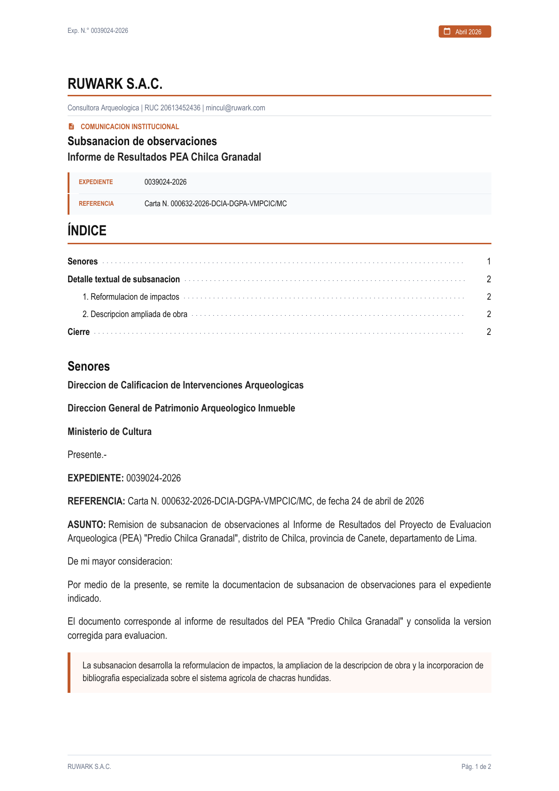
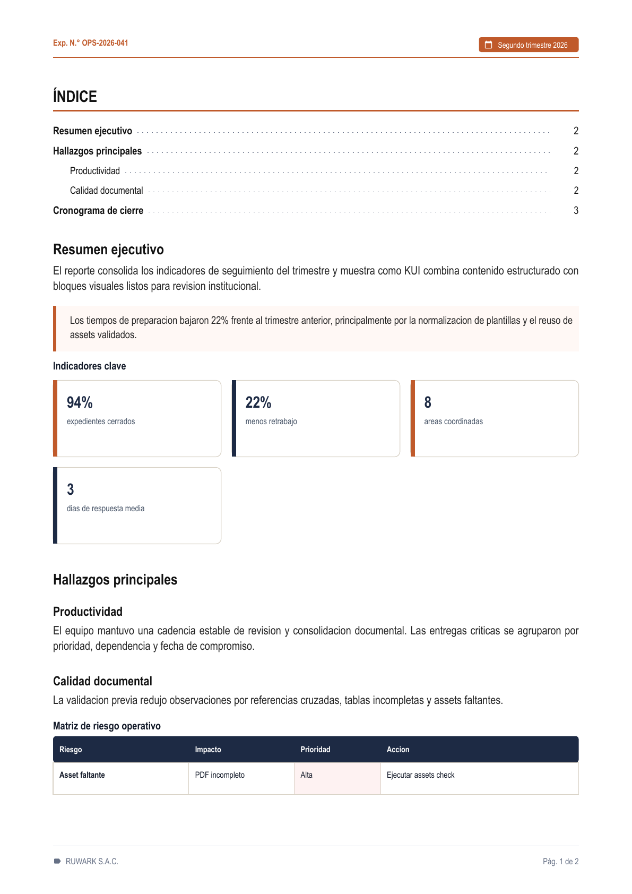
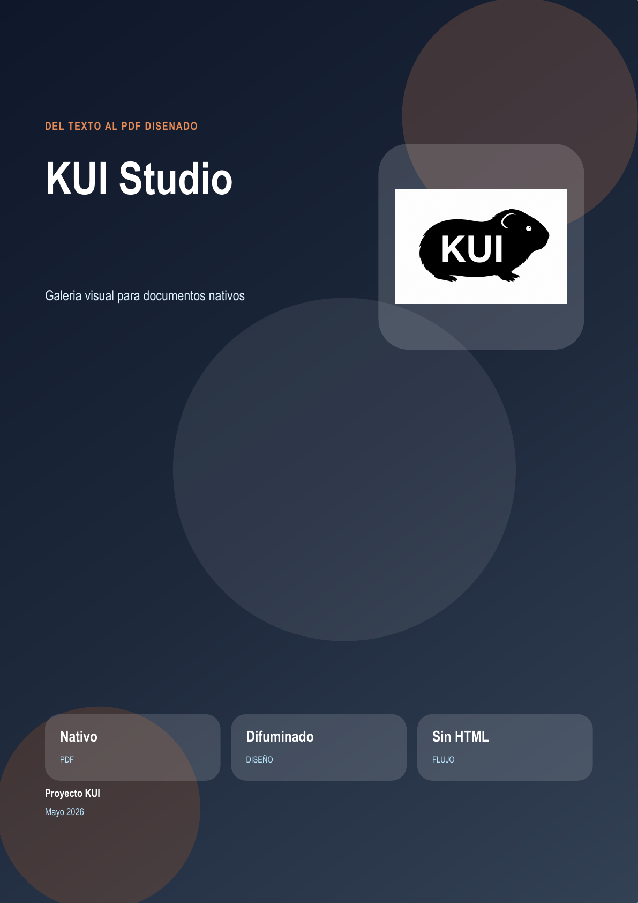
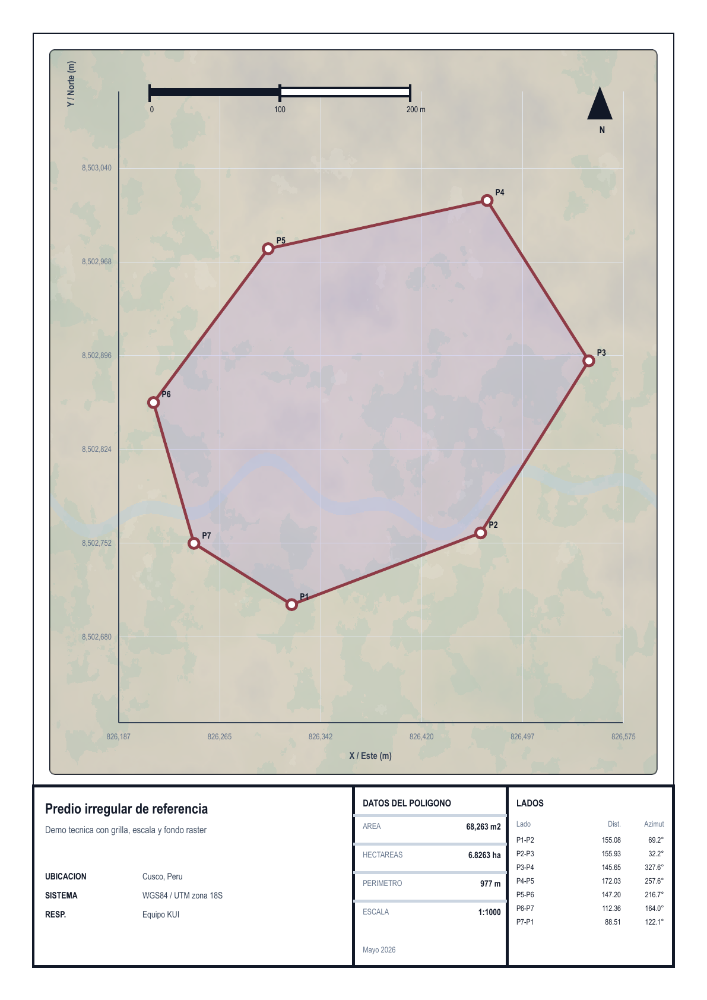

# Galeria visual de KUI

Esta galeria muestra resultados reales del renderer nativo: cada preview sale de un archivo `.kui` compilable. La idea es que un usuario tecnico vea rapidamente la relacion entre fuente versionable y PDF cuidado.

Para regenerar todos los PDFs y previews:

```bash
npm run gallery
```

Los PDFs quedan en `build/gallery/`. Las miniaturas versionadas viven en `docs/gallery/previews/`.
El manifest `examples/gallery/gallery.json` permite fijar `previewPage` cuando la portada no es la pagina mas representativa.

## Demos

| Preview | Demo | Que muestra |
| :--- | :--- | :--- |
|  | [Carta institucional](../examples/gallery/carta-institucional.kui) | Comunicacion formal con indice, metadatos, encabezado y tipografia narrow. |
|  | [Informe operativo](../examples/gallery/informe-operativo.kui) | Portada sobria, KPIs, matriz de riesgo, cronograma y firmas. |
|  | [Brochure visual](../examples/gallery/brochure-visual.kui) | Portada editorial, paneles degradados, grafico nativo y assets. |
|  | [Plano tecnico](../examples/gallery/plano-tecnico.kui) | Grilla UTM, escala, coordenadas y fondo raster. |

## Fragmentos

Carta institucional:

```kui
plantilla: carta-institucional
titulo: Subsanacion de observaciones
organizacion: RUWARK S.A.C.
referencia: "Carta N. 000632-2026-DCIA-DGPA-VMPCIC/MC"

indice

# Senores
> La subsanacion desarrolla la reformulacion de impactos.
```

Informe operativo:

```kui
:::kpi-grid
- 94% expedientes cerrados
- 22% menos retrabajo
- 8 areas coordinadas
:::
```

Brochure visual:

```kui
:::gradient-panel {title="Sintaxis corta, salida cuidada" from="#111827" to="#334155" accent="#E88B55"}
El mismo archivo fuente define portada, paneles, tablas y graficos.
:::
```
